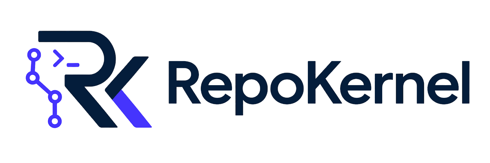

<p align="center">
  <picture>
    <source media="(prefers-color-scheme: dark)" srcset="./docs/assets/logo-dark.png">
    <source media="(prefers-color-scheme: light)" srcset="./docs/assets/logo-light.png">
    
  </picture>
</p>

<p align="center">
  <a href="https://www.npmjs.com/package/repokernel"></a>
  <a href="https://github.com/xantorres/repokernel/actions/workflows/ci.yml"></a>
  <a href="LICENSE"></a>
</p>

<h3 align="center">Run AI coding agents in isolated Git worktrees, with checks before merge.</h3>

<p align="center">
Isolation, review gates, merge safety, and state recovery — for any coding agent.<br>
Agent-agnostic. No daemon, no database, no cloud.
</p>

---

## Why RepoKernel exists

Running one AI coding agent is easy. Running three in parallel against the same repo is where things fall apart.

**State conflicts.** Two agents update `registry.json` on different branches. `git merge` produces conflict markers. The merge blocks until a human fixes it by hand.

**No visibility.** You open four terminal tabs and grep log files to figure out which agent is on which task, and what it last touched.

**Double-dispatch.** Both dispatch loops pick up the same sprint. One succeeds; the other discards hours of work — or worse, produces inconsistent output that silently merges.

**Scope creep.** An agent touches files outside its task boundary. You don't notice until the PR review finds unintended changes mixed in with the real work.

RepoKernel fixes each of these at the filesystem layer:

| Problem | Mechanism |
|---|---|
| State conflicts | Git merge driver (per-clone install) — unions sprints/epics by id and resolves status symmetrically so `mergeRegistries(a, b)` always equals `mergeRegistries(b, a)` |
| No visibility | `rk team status` — one snapshot of runs, sprints, registry health, and current bottlenecks |
| Double-dispatch | `claimSprint` — atomic lock file per sprint under `<opRoot>/claims/`, `withLockRetrying` |
| Scope creep | `allowed_paths` in sprint frontmatter, validated at review time before merge |

The constraint: no daemon, no cloud service, no mandatory tracker. Your repo is the source of truth. `git push` is the deployment. The agents you already pay for stay the agents you use.

If you can `git clone`, you can run RepoKernel.

## Try it in 60 seconds

```bash
npm i -g repokernel
cd your-git-repo
rk init --commit
rk run -m "Add a README section about RepoKernel" --agent fake
rk close T-001          # review + checks pass, then merge to main
```

What just happened: RepoKernel initialized and committed its metadata, synthesized `T-001`, opened an isolated worktree, ran the deterministic `fake` agent, and paused for review. `rk close` runs the review and checks, then merges into `main` only once they pass — with a full audit trail.

No API keys, no cloud calls. `fake` is a deterministic test agent that writes a placeholder file. Swap it for `--agent claude` or `--agent codex` when you're ready for real coding.

> Requires Node 20+ and a Git repository.

## Let your agent drive RepoKernel

The CLI is the substrate. The **skill is the real interface** for agent-driven work.

Install the skill into your agent's rules directory:

| Agent / IDE | Command |
|---|---|
| Claude Code | `rk install-skill` |
| Cursor | `rk install-skill --ide cursor` |
| Windsurf | `rk install-skill --ide windsurf` |
| GitHub Copilot | `rk install-skill --ide copilot` |
| Gemini CLI | `rk install-skill --ide gemini` |
| opencode | `rk install-skill --ide opencode` |

By default, IDE installs go to your user-global rules directory (`~/.cursor/rules/`, `~/.windsurf/rules/`, etc.). Add `--project` to scope the install to the current repo instead:

```bash
rk install-skill --ide cursor --project   # .cursor/rules/repokernel.mdc
```

Once installed, your agent stops guessing the lifecycle from prose and starts using seven purpose-built verbs (lifecycle order — start with `plan`, end with `doctor` only when something drifts):

| Verb | Slash | Does |
|---|---|---|
| plan | `/rk-plan` | Scaffold an epic into 1–3 sprints from intent; never auto-executes |
| status | `/rk-status` | Read-only dashboard: epics, next sprint, P0/P1 count |
| next | `/rk-next` | Resolve the next runnable sprint with tier-routed cost band |
| run | `/rk-run` | Execute sprint / epic / fastpath; pause on review or failure |
| review | `/rk-review` | Spawn parallel review panel; merge findings; record verdict |
| doctor | `/rk-doctor` | Drift triage; surfaces a fix plan; never auto-applies |
| reject | `/rk-reject` | Persist an out-of-scope decision |

Then talk to your coding agent in plain English:

> _"Check RepoKernel status, run the next sprint, and review when it's done."_

**Why this matters:** agents that infer state from markdown tables corrupt that state. The skill teaches them validation gates, stop conditions, tier-to-model routing, and exactly when to halt. With the skill loaded, the agent never edits `.repokernel/**` directly — the bundled `PreToolUse` hook denies any tool call that targets state paths and routes the agent through `rk` verbs. Humans can still hand-edit state files (sometimes the right call); `rk validate` and `rk fix --apply` re-derive invariants.

## Why worktrees + validation gates

**Isolation by construction.**
Every task runs in its own `git worktree`. Your `main` branch stays clean until merge. Parallel agents fan out without colliding on review IDs, plan state, or commits.

**Pre-flight before work.**
`rk validate --fail-on P0,P1` blocks unsafe project state in milliseconds, way cheaper than discovering it in CI three commits later. Use it as a gate, hook, or just before starting a session.

**Review gate before merge.**
Configured checks must pass. A review verdict must be recorded. `rk gates S-NNN` runs the configured command, path checks, validation, and registry check in one pass; `rk ship S-NNN` runs review, close, validation, and registry check as one visible flow. Failed checks leave the task in `active` so you can retry with `rk run T-NNN` or drop it with `rk discard T-NNN`.

**Scope guardrails.**
`allowed_paths` in sprint frontmatter flags out-of-scope edits at review time. The agent can still try; it can't ship outside agreed scope without a visible override.

## Real coding agents

Swap `fake` for an LLM-backed adapter:

```bash
rk run -m "Add a /health endpoint that returns 200 OK" --agent claude
```

| Adapter | Notes |
|---|---|
| `claude` | [Claude Code](https://docs.anthropic.com/claude-code) CLI. [Setup](docs/agents/claude.md) |
| `codex` | [OpenAI Codex](https://openai.com/codex) CLI. [Setup](docs/agents/codex.md) |
| `ollama` | Local model via [Ollama](https://ollama.ai). No API keys, no cloud |
| `fake` | Deterministic test agent. Perfect for demos and CI |
| `manual` | Pauses so you do the work yourself |
| custom | Any shell command, configured in `repokernel.config.yaml` |

Configure required checks once in `repokernel.config.yaml`:

```yaml
automation:
  reviewer: codex
  checksCmd: pnpm lint && pnpm typecheck && pnpm test
```

## Multi-agent operations

Built for teams running 3+ agents in parallel against a shared repo.

### Team status — answer "what is each agent doing?" in one command

```bash
rk team status
```

```
team status — 2026-05-04T13:30:00Z

Runs
RUN     EPIC      STATUS    ACTIVE  READY  REVIEW  STARTED              ETA
RUN-005 E-team-core running 3       1      1       2026-05-04 13:00:00  2026-05-04 14:12:00
RUN-006 E-042     running   1       0      0       2026-05-04 13:25:00  2026-05-04 14:01:00

Sprints
SPRINT          STATUS  LANE  AGENT  PROGRESS  TITLE
S-merge-safe    active  core  claude 67%       P0: Merge-Safe State
S-team          active  core  codex  33%       P1: Team Status Visibility

Registry
  health=OK  ready_to_merge=true  conflicts=0  files_changed=0

Bottlenecks
  • S-tracker: awaiting_review
```

`--json` for dashboards. `--watch` for a refreshing terminal view (15s interval floor, SIGINT-safe). `--sprint <id>` to drill in. The dashboard composes data from run files (live), the registry (declared state), and the operational lane state — one snapshot, no scattered tabs.

### Merge-safe registry — deterministic when the driver is installed

**Scope.** The driver is a per-clone configuration. Determinism only holds for merges performed by a clone where the driver is installed (`.gitattributes` entry + local `merge.repokernel-registry.*` git config). GitHub's web merge buttons, GitLab's UI merges, and other hosted environments do **not** execute your local merge driver and will leave JSON conflict markers exactly as they would without RepoKernel. For the per-clone case:

`rk init` installs a `.gitattributes` entry plus per-clone git config for RepoKernel's custom merge driver. When the clone performing the merge has that driver installed and two branches both modify `.repokernel/registry.json`, the driver:

- Unions sprints, epics, reviews by id.
- Picks the more-progressed status (`shipped > review > active > ...`) symmetrically — `mergeRegistries(a, b)` and `mergeRegistries(b, a)` produce the same registry.
- Surfaces real conflicts (diverged sprint title, lane, gate) as machine-readable `MergeConflict[]` rather than silent local-wins.
- Re-derives `health.blocked` from the merged finding set so visible state and summary cannot drift.

**Workflow.** Commit a sprint on `feature-a`, your colleague commits another on `feature-b`, and `git merge` performed locally uses the driver — no JSON conflict markers. Fresh clones must run `rk init` (or `rk doctor` if the repo was already initialized) before the driver is wired. `rk doctor` verifies the `.gitattributes` line and the three `merge.repokernel-registry.*` git config keys; missing or drifted entries fail the diagnostic with an exact remediation. For hosted-web merges, prefer local merges or run `rk validate` in CI to catch any registry drift the moment it lands.

### Atomic sprint claims — no double-spawn under concurrent dispatch

Two parallel `rk run` invocations cannot both pick up the same sprint. Each agent spawn is gated by `claimSprint` (`<opRoot>/claims/<sprintId>.json`, `withLockRetrying`). The wave dispatcher honours per-state concurrency caps:

```yaml
# repokernel.config.yaml
parallel:
  maxConcurrentSprints: 6
  maxConcurrentSprintsByState:
    review: 1   # bottleneck — careful
    active: 6   # main work
    pending: 2  # cheap; can wait
```

### Tracker bridge — Linear / Jira / GitHub Issues without the lock-in

```bash
rk tracker link S-042 gh:owner/repo#123
rk tracker comment S-042 "Agent finished — review pending"
rk tracker link-pr S-042 https://github.com/owner/repo/pull/456
rk tracker transition S-042 closed
```

Adapters declare capability via optional methods on the `TrackerAdapter` interface. The gh adapter implements all three writes today; Linear and Jira return `not_implemented` cleanly until their adapters are wired. URL persistence rejects `javascript:`, `data:`, `vbscript:`, `file:`, `ftp:` schemes at the schema layer.

### PR bridge — agent → GitHub PR shepherd

```bash
rk pr link S-042 https://github.com/owner/repo/pull/456
rk pr body S-042 --write              # generate body from sprint, post to PR
rk pr sync S-042                       # refresh status: open/draft/merged/closed
rk pr comment S-042 "Tests green; ready for review"
```

`renderPrBody` is pure — same sprint, same body, no spurious diffs. Provider inference returns an explicit `unknown` for non-public hosts so `rk pr link` cannot silently mis-categorise self-hosted GitLab Enterprise URLs as GitHub.

### Why this matters

You don't need a hosted service to run a coordinated multi-agent fleet. You need a repo, a CLI, and a clean discipline. RepoKernel ships the discipline.

See [team status](docs/usage/team-status.md), [merge safety](docs/usage/merge-safety.md), [tracker bridge](docs/usage/trackers.md), [PR bridge](docs/usage/pr-bridge.md) for the full surface.

## How RepoKernel differs from agent-native workflows

Coding agents are growing their own orchestration — Claude Code runs parallel subagents, Codex chains tool calls. RepoKernel does not compete with that. It sits one layer down, around *any* agent:

| The agent decides | RepoKernel enforces |
|---|---|
| What to change, how to plan it, when to spawn subagents | Each run lands in an isolated worktree — never your working tree |
| Which files to touch | `allowed_paths` scope, checked before merge |
| When the task is "done" | Review gates + your `checksCmd` must pass before anything reaches `main` |
| — | Deterministic registry merges; atomic claims so two runs never collide |
| — | State recovery — a crashed or runaway agent leaves a resumable run, not a corrupted repo |

The agent runs the subagents. RepoKernel controls the Git lifecycle around them: worktrees, scope, review, merge, and recovery. Bring whichever agent you like.

## Going bigger: epics, sprints, parallel waves

For multi-task projects:

```bash
rk create epic "Migrate auth to OAuth2"
rk plan E-001 --create-sprint --enqueue
rk wave E-001
rk run E-001 --agent claude
```

`rk plan E-001 --create-sprint --enqueue` authors a straightforward sprint and appends it to its lane queue in one step. `rk wave E-001` previews dependency order; add `--apply` when you want RepoKernel to enqueue eligible planned work.
Pass `--json` to any `rk create <kind>` command for a machine-readable
envelope (`{ kind, id, file, updated, next_actions }`) suited to agent
chaining.

- **Dependency-aware queues.** `rk next` walks the graph and surfaces the runnable sprint after every merge; `rk next --include-planned` can also point at dependency-unblocked planned work.
- **Atomic review allocation.** Review IDs come from a counter at git-common-dir, not the worktree. Parallel agents never collide.
- **Parallel waves with safety checks.** Independent sprints with non-overlapping `allowed_paths` can run in the same wave. Gated sprints pause execution until the gate is resolved.
- **Boring ceremony, one command.** `rk ship S-NNN` closes an accepted sprint with validation and registry checks; `rk epic ship E-NNN` closes the epic once all sprints have shipped or been cancelled.
- **Cold-start summaries.** `rk epic status E-001` returns shipped / in-review / queued / blocked in five lines, so a fresh agent session catches up without re-reading 200-line tables.

See [parallel waves](docs/internals/parallel-waves.md) for fan-out semantics, and [advanced quickstart](docs/internals/quickstart-advanced.md) for a full multi-sprint walkthrough.

## Tracker-friendly

RepoKernel works alongside JIRA, Linear, and GitHub Issues without duplicating tickets. The strongest path is: issue or task → isolated worktree → agent run → review gate → PR / merge → audit trail.

**Run a ticket as a fastpath task.**

```bash
rk run --from-tracker gh:owner/repo#42 --agent claude
# or keep fallback text available if the tracker is unreachable:
rk run -m "Fallback task summary" --from-tracker jira:PROJ-2293 --agent claude
```

`--from-tracker` uses the ticket title and body as synthetic task context and stores tracker metadata on the generated epic and `T-NNN` alias. Fetch failures fail closed before any IDs are allocated unless you pass `--allow-tracker-fallback`.

**Pull a ticket into a planned epic.**

```bash
rk create epic "fallback title" --from-tracker jira:PROJ-2293
# or: --from-tracker gh:owner/repo#42
# or: --from-tracker linear:ABC-12
```

The bridge pulls title, description, labels, and assignee into `extras.tracker_*` on the new epic. Ingest never writes back. Write-side tracker operations are explicit (`rk tracker comment`, `rk tracker link-pr`, `rk tracker transition`) and adapter-gated. See [tracker integration](docs/usage/trackers.md).

**Custom branch naming.**

```yaml
# repokernel.config.yaml
worktrees:
  epicBranchPattern: "feature/epic/{epicId}"
  sprintBranchPattern: "feature/sprint/{epicId}/{sprintId}"
```

Override the default `rk/epic/E-001` and `rk/sprint/E-001/S-001` naming with your team's convention. Tokens: `{branchPrefix}`, `{epicId}`, `{sprintId}`. Epic and sprint refs must not collide as Git paths. See [config reference](docs/internals/config-reference.md#branchpattern).

**CI gate as a GitHub Action.**

```yaml
- uses: xantorres/repokernel/.github/actions/rk-validate@v1
  with:
    fail-on: P0,P1
```

Runs `rk validate` on every PR, posts a sticky comment with finding counts, emits inline annotations, and uploads JSON findings as an artifact. Skips gracefully (neutral exit `0`) on repos without `repokernel.config.yaml`. See [CI usage](docs/usage/ci.md).

End-to-end recipe wiring all three: [tracker-driven flow](docs/recipes/tracker-driven-flow.md).

## Four ways to use it

| Level | For | Entry point |
|---|---|---|
| **Fastpath**: one task, one worktree, done | Quick AI coding tasks | `rk run -m "..."` |
| **Agent-operated**: your agent drives `rk` via the bundled skill | Daily work with Claude / Codex / custom | `rk install-skill` |
| **Advanced**: epics, sprints, dependency graphs, parallel waves | Multi-task projects, parallel agents | `rk create epic` then `rk run E-001` |
| **Multi-agent**: team status, merge-safe state, tracker + PR bridges | Teams running 3+ agents in parallel | `rk team status`, `rk pr link`, `rk tracker comment` |

Want a quick snapshot? `rk report` prints health, next work, epics, sprints, and findings straight to your terminal (`--json` for machine output).

## When it's overkill

- One-off shell scripts or single-file tweaks
- Throwaway prototypes you never plan to merge
- Non-Git workflows
- Teams that already gate via CI + branch protection and just want raw agent output piped to a PR

## Examples

- [`examples/fastpath`](examples/fastpath): minimal one-task project
- [`examples/issue-fastpath`](examples/issue-fastpath): issue-shaped fastpath flow with deterministic `fake` agent
- [`examples/basic`](examples/basic): single-epic starter
- [`examples/parallel`](examples/parallel): parallel sprints
- [`examples/external-agent`](examples/external-agent): wiring a custom adapter

## Documentation

**Multi-agent**
- [End-to-end demo](docs/usage/demo.md): GitHub issue → sprint → agent → PR → review → merge, step by step
- [Team status](docs/usage/team-status.md): live dashboard of runs, sprints, registry health, bottlenecks
- [Merge safety](docs/usage/merge-safety.md): how the registry survives concurrent agent edits
- [Tracker bridge](docs/usage/trackers.md): import + comment + transition + link-pr across Linear / Jira / GitHub
- [PR bridge](docs/usage/pr-bridge.md): generate, link, sync, comment on pull requests

**Fundamentals**
- [Fastpath in depth](docs/fastpath.md): what the three-command flow does behind the scenes
- [CLI reference](docs/internals/cli-reference.md): every command, every flag
- [Concepts](docs/internals/concepts.md): model and schema reference
- [Parallel waves](docs/internals/parallel-waves.md): how fan-out and gates compose
- [Recipes](docs/recipes/README.md): patterns for project-owned orchestration on top of `rk` (e.g. multi-agent panels, pause-gate briefs, chained-epic protocols)
- [Detailed README](docs/internals/README-detailed.md): full feature surface

## Status

Local-first. No daemon, no database, no hosted service. RepoKernel is a CLI plus a state directory under `.repokernel/` (or any path you choose with `rk init --dir <path>`). Schema and CLI are still evolving; pin a version (see [CHANGELOG.md](CHANGELOG.md)) if you embed it in CI.

## License

MIT. See [LICENSE](LICENSE).
